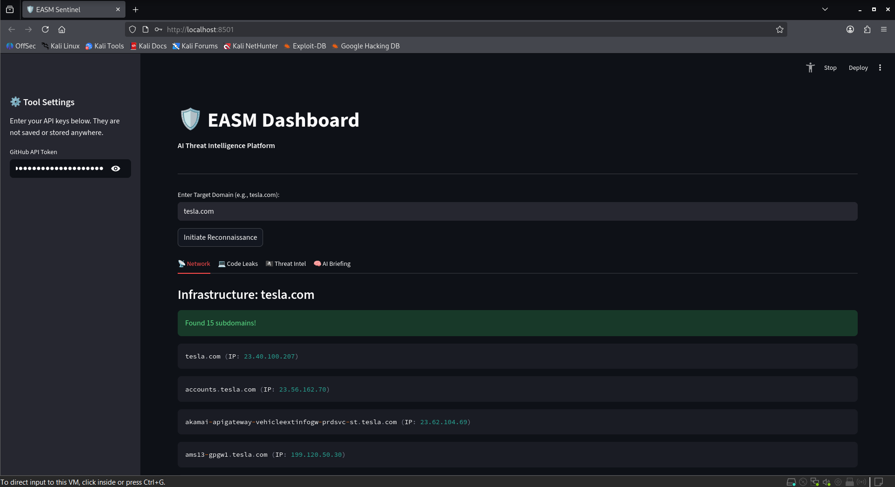

#  EASM & Threat Intelligence Platform

This is an advanced, automated External Attack Surface Management (EASM) and Threat Intelligence dashboard. It utilizes deterministic OSINT workflows to map target infrastructure, identify leaked credentials, and pull active threat campaigns—synthesizing the intelligence using a **fully air-gapped, local LLM** to generate executive security briefings with zero data leakage.



##  The OPSEC Advantage: Zero-Leakage AI
Traditional AI tools (like ChatGPT or Claude) require sending highly sensitive reconnaissance data to third-party servers. Project Sentinel mitigates this critical OPSEC risk by utilizing an offline Small Language Model (SLM) via **Ollama**. Client domains, exposed secrets, and threat vectors never leave your local machine.

##  Core Capabilities

1. **Network Intelligence (HackerTarget)**
   - Maps external attack surfaces by passively querying known subdomains and resolving their corresponding IP addresses.
2. **Public Code Leaks (Authenticated GitHub API)**
   - Bypasses unauthenticated rate limits using a Personal Access Token (PAT).
   - Implements advanced Python-side filtering to extract high-fidelity configuration files (`.env`, `.yml`, `.json`, `.config`) while aggressively filtering out API documentation noise (e.g., Swagger, OpenAPI directories).
3. **Threat Intelligence (AlienVault OTX)**
   - Cross-references the target domain against live AlienVault threat pulses.
   - Automatically filters out low-level phishing/spam noise to prioritize high-severity infrastructure attacks, APT campaigns, and CVEs.
4. **Local AI Briefing (LangChain + Phi-3)**
   - Acts as an automated CISO. It ingests the raw OSINT data across all three streams and drafts a concise, factual executive summary outlining potential lateral movement risks and breach scenarios.

##  Installation & Setup

### 1. Prerequisites
- Python 3.9+
- [Ollama](https://ollama.com/) installed on your local machine.

### 2. Install the Local LLM
Pull the Microsoft Phi-3 model via Ollama (used for fast, lightweight threat analysis):
```bash
ollama run phi3
```

### 3. Clone and Install Dependencies
```bash
git clone [https://github.com/Bharath-2204/EASM-Dashboard.git](https://github.com/Bharath-2204/EASM-Dashboard.git)
cd EASM-Dashboard
pip install -r requirements.txt
```

### 4. Run the Dashboard
```bash
streamlit run app.py
```

##  Usage Instructions
1. Open the local Streamlit dashboard in your browser.
2. In the **Tool Settings** sidebar, paste your GitHub Personal Access Token (PAT). *Note: Ensure your PAT has the `public_repo` scope. Tokens are not logged or stored.*
3. Enter the target domain (e.g., `tesla.com`) and click **Initiate Reconnaissance**.
4. Review the multi-tab intelligence report and the generated AI briefing.

## ⚠️ Disclaimer
This tool is designed strictly for authorized threat intelligence gathering, bug bounty hunting, and educational purposes. Ensure you have explicit permission before probing target infrastructure. The developer is not responsible for misuse or damage caused by this program.
