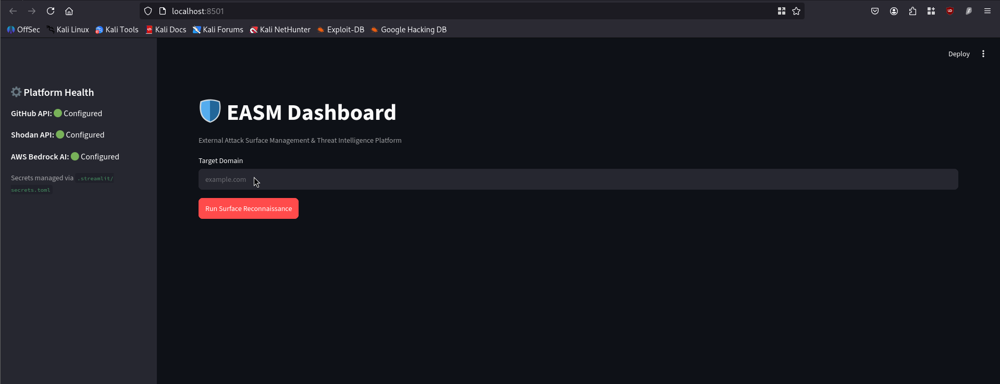

# EASM — External Attack Surface Management & Threat Intelligence Platform

This is a Python-based, multi-threaded External Attack Surface Management (EASM) and Threat Intelligence platform built with Streamlit. It automates passive OSINT workflows to map external infrastructure, inspect TLS/SSL endpoints, identify exposed assets, detect potential credential leaks, calculate CVSS-weighted risk scores, and export STIX 2.1 threat intelligence bundles.

AI-assisted analysis is powered by **AWS Bedrock**, using the unified Converse API with models such as **Meta Llama 3.1 8B** and **Claude 3.5 Haiku**. The platform generates executive threat briefings and MITRE ATT&CK mappings based on collected security telemetry.



---

## Core Capabilities

### 1. Passive Subdomain Discovery
- Collects external attack-surface subdomains using **HackerTarget** and **crt.sh**.
- Uses passive Certificate Transparency data to identify additional subdomains.
- Handles upstream API timeouts without interrupting the overall workflow.

### 2. TLS/SSL Endpoint Inspection
- Performs direct socket-level TLS/SSL inspection of port 443.
- Analyzes certificate issuers, expiration dates, remaining validity, supported cipher suites, and Subject Alternative Names (SANs).

### 3. Shodan Host Intelligence
- Uses Shodan's passive search API to identify publicly exposed hosts.
- Collects IP addresses, open ports, hostnames, and hosting-provider information.

### 4. Public Code Leak Detection
- Uses the GitHub API to search publicly accessible code for potentially exposed sensitive files.
- Applies extension-based filtering for files such as `.env`, `.yml`, `.json`, and `.config`.
- Suppresses common repository noise, including Swagger/OpenAPI schemas.

### 5. CVSS-Weighted Risk Engine
- Aggregates findings across reconnaissance sources.
- Calculates an **Attack Surface Risk Score (0–100)**.
- Assigns findings to categorical severity levels based on the resulting risk score.

### 6. AI Threat Briefing & MITRE ATT&CK Mapping
- Uses **AWS Bedrock** to generate executive-level security briefings from collected telemetry.
- Maps identified exposure patterns to **MITRE ATT&CK Enterprise techniques**.
- Uses Bedrock's `converse_stream` API to stream generated results.

### 7. STIX 2.1 & SIEM Export
- Generates **STIX 2.1 JSON bundles** containing Cyber Observable and Domain/Infrastructure objects.
- Exports raw JSON telemetry for integration with SIEM and SOAR workflows.
- Provides one-click access to generated security intelligence artifacts.

---

## Workflow

```text
Target Domain
      │
      ▼
Passive OSINT Collection
      │
      ├── Subdomain Discovery
      ├── TLS/SSL Inspection
      ├── Shodan Host Intelligence
      └── GitHub Code Search
      │
      ▼
Finding Aggregation
      │
      ▼
CVSS-Weighted Risk Scoring
      │
      ▼
AWS Bedrock
      │
      ├── Threat Briefing
      └── MITRE ATT&CK Mapping
      │
      ▼
STIX 2.1 / JSON Export
      │
      ▼
SIEM / SOAR Integration
```

---

## Technology Stack

- **Language:** Python 3.10+
- **Interface:** Streamlit
- **Cloud/AI:** AWS Bedrock
- **Threat Intelligence:** MITRE ATT&CK, Shodan, HackerTarget, crt.sh
- **Code Intelligence:** GitHub API
- **Risk Analysis:** CVSS
- **Threat Intelligence Format:** STIX 2.1
- **Potential Integrations:** SIEM / SOAR platforms

---

## Installation & Prerequisites

### Prerequisites

- **Python 3.10+**
- An **AWS account** with access to Amazon Bedrock
- Access to a supported Bedrock model such as:
  - Meta Llama 3.1 8B Instruct
  - Claude 3.5 Haiku

Optional API credentials:

- **GitHub Personal Access Token** — required for GitHub code searches
- **Shodan API Key** — required for Shodan host intelligence

### Clone the Repository

```bash
git clone https://github.com/Bharath-2204/EASM-Dashboard.git
cd EASM-Dashboard
pip install -r requirements.txt
```

---

## Configuration

Create a `.streamlit/secrets.toml` file in the project root:

```toml
# AWS Bedrock
AWS_REGION = "us-east-1"
AWS_ACCESS_KEY_ID = "YOUR_AWS_ACCESS_KEY_ID"
AWS_SECRET_ACCESS_KEY = "YOUR_AWS_SECRET_ACCESS_KEY"

# Bedrock Model
BEDROCK_MODEL_ID = "us.meta.llama3-1-8b-instruct-v1:0"

# External Reconnaissance
GITHUB_TOKEN = "your_github_pat_here"
SHODAN_API_KEY = "your_shodan_api_key_here"

# Operational Limits
EASM_TIMEOUT = "8"
EASM_MAX_WORKERS = "5"
```

---

## Running the Dashboard

Launch the Streamlit application:

```bash
streamlit run app.py
```

Then open:

```text
http://localhost:8501
```

---

## Usage

1. Launch the dashboard.
2. Verify the integration status using the **Platform Health** indicators.
3. Enter an authorized target domain.
4. Select **Run Surface Reconnaissance**.
5. Review the generated results across the following tabs:
   - **CT Subdomains** — discovered subdomains from passive sources.
   - **TLS Audit** — certificate and TLS endpoint information.
   - **Shodan Passive** — publicly exposed hosts, ports, and infrastructure.
   - **GitHub Leaks** — potentially exposed sensitive files in public repositories.
   - **AI Threat Briefing** — generated threat summary and MITRE ATT&CK mapping.
   - **STIX & Exports** — STIX 2.1 bundles and raw JSON telemetry.

---

## Security & Responsible Use

This project is intended for **authorized security assessments and educational threat intelligence research**.

Only scan domains and infrastructure that you own or have explicit authorization to assess. Do not use the platform to access, collect, or disclose information from systems without permission.

The developer assumes no liability for unauthorized or unlawful use of the platform.
